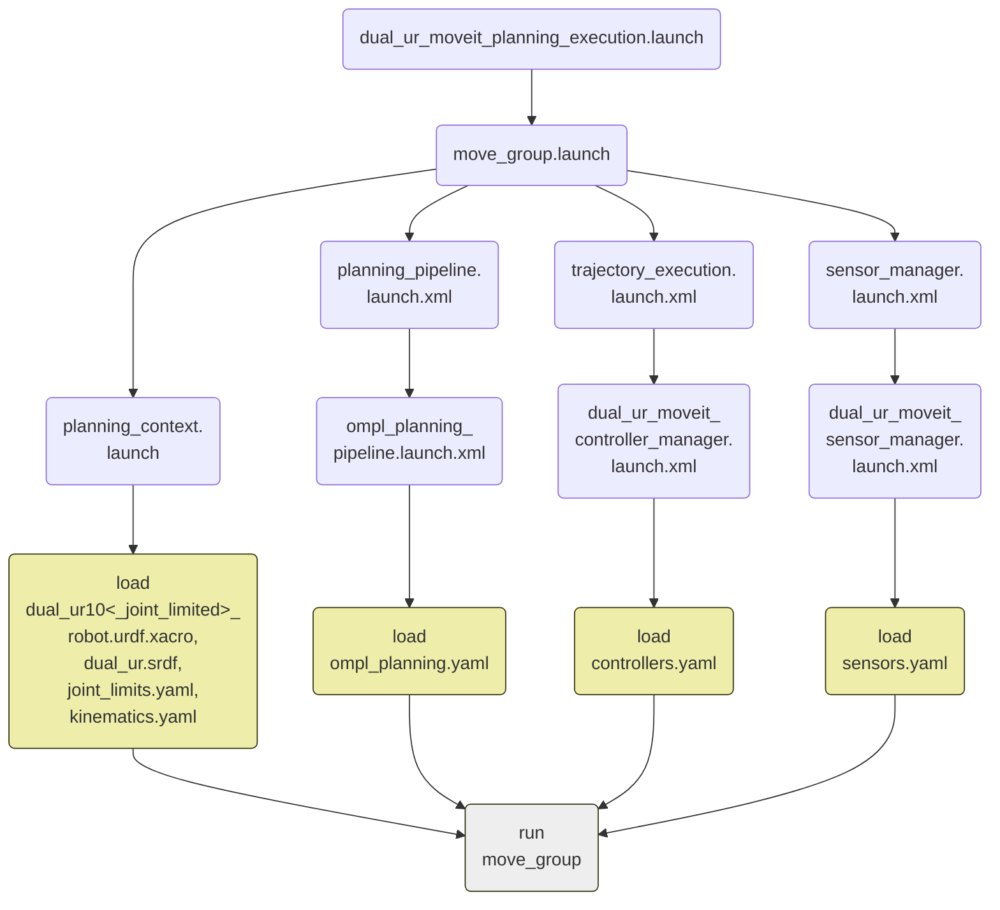

在ur10_moveit_config的基础上修改为双臂机器人的配置

## 1. dual_ur_moveit_config

`dual_ur_moveit_config`是双机械臂的`moveit!`配置包，包含了进行运动规划所需的文件。

### 1.1 config/：

#### 1.1.1 controller.yaml

`moveit!`路径规划控制器的配置文件，表明运行`moveit!`时`move_group`节点会订阅`left(right)_arm_controller/follow_joint_trajectory`动作话题，**注意保持前后一致**。

**修改**：两个机器人应有双套关节，复制一套，name分别为`left_arm`和`right_arm`

#### 1.1.2 dual_ur.srdf

双机械臂模型结构的语义信息，记录了使用`moveit_assistant`进行的设置。一旦更改了机器人的模型，如添加末端抓手，就要重新调用`moveit_assistant`更新碰撞检测矩阵。

此文件不能代替URDF，也不是URDF的扩充，URDF文件必须存在，定义所提及的关节和关节轴（joints、links）

**修改**：

* robot name="dual_ur"

* group 复制一套，name分别为`left_arm`和`right_arm`

groups：代表一系列jionts和links（关节和关节轴），可以用来设置自己的多自由度机器人，定义手臂、末端等

links：指定了一个关节轴，它的父关节（如果有）会自动引入

joints：指定了一个关节，它的子关节轴（如果有）会自动引入

chains：指定了一个链，所有关节轴和它们的父关节都被引入这个group

* group_state 复制一套

group states：定义一个group的状态，并取名

* end_effector 复制一套

end effector：代表末端信息

* virtual_joint 不变

* disable_collisions 修改

disable collisions：默认都可以碰撞，这个标签可以禁止某两个轴之间的碰撞

**注**：关节轴（links）和关节（joints）的名称在URDF文件中定义

#### 1.1.3 joint_limits.yaml

**修改**：设置关节极限，复制一套

### 1.2 launch/：

#### 1.2.1 dual_ur_moveit_planning_execution.launch

moveit!规划器的启动程序。实际上就是设置`limited`参数后再调用`move_group.launch`，因此以下两条命令等价：

```shell
roslaunch dual_ur_moveit_config dual_ur_moveit_planning_execution.launch [limited:=true]
roslaunch dual_ur_moveit_config move_group.launch [limited:=true]
```

**修改**：改文件名，内容不改

#### 1.2.2 move_group.launch

运动规划最重要的节点`move_group`的启动程序。它的调用层次结构如下图。首先调用一系列launch文件加载运动规划所需的配置文件，最后启动move_group节点。



**修改**：改名字 $(find dual_ur_moveit_config)

#### 1.2.3 所有文件中的ur10改为dual_ur

主要的$(find dual_ur_moveit_config)

涉及文件有：`demo.launch`, 

`fake_moveit_controller_manager.launch.xml`, 

`move_group`, 

`moveit_rviz.launch`, 

`ompl_planning_pipeline.launch`, 

`planning_context.launch`, 

`planning_pipeline.launch.xml`, 

`run_brenchmark_ompl.launch`, 

`sensor_manager.launch.xml`, 

`trajectory_execution.launch.xml`, 

`dual_ur_moveit_controller_manager.launch.xml`, 

`dual_ur_moveit_sensor_manager.launch.xml`, 

`warehouse.launch`

#### 1.3 其他文件夹和文件

#### 1.3.1 tests/：

文件夹中有一个文件，把ur10改为dual_ur

#### 1.3.4 package.xml

改`package.xml`中的名字


## 2 dual_ur_description

`dual_ur_description`包是双机械臂系统的描述文件。包括urdf描述文件、meshes模型文件。

### 2.1 urdf/：

#### 2.1.1 dual_ur_robot.urdf.xacro

双机械臂的描述文件

**修改**：

* 将`ur10`替换为`dual_ur`

* 将`ur_description`替换为`dual_ur_description`

* 新增：

```
     <!-- prefix of two arms -->
  <xacro:property name="prefix1" value="left_" />
  <xacro:property name="prefix2" value="right_" /> 
```

* 添加一个arm

```
  <!-- arm -->
  <!-- left_arm -->
  <xacro:dual_ur_robot prefix="left_" joint_limited="false"
    transmission_hw_interface="$(arg transmission_hw_interface)"
  />
  <!-- right_arm -->
  <xacro:dual_ur_robot prefix="right_" joint_limited="false"
    transmission_hw_interface="$(arg transmission_hw_interface)"
  />
```


#### 2.1.2 ur10.urdf.xacro

将`ur_description`替换为`dual_ur_description`

#### 2.1.3 dual_ur10_joint_limited_robot.urdf.xacro

* prefix of two arms: left, right
* 复制一套`xacro:ur10_robot`
* 删除了kinematics_config的语句

### 2.2 launch/

#### 2.2.1 dual_ur_upload.launch


## 3 ur_robot_driver

### 3.1 launch/

#### 3.1.1 dual_ur_bringup.launch